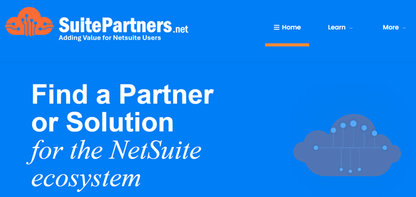

# Content Guide — Smart Applications, LLC website

This site is fully designed and styled. Every section has placeholder copy
you can replace directly in `index.html` — you shouldn't need to touch
`assets/css/style.css` or `assets/js/main.js` unless you want to change the
design itself.

Every editable spot is marked with an `<!-- EDIT: ... -->` comment right
above it in `index.html`. Search the file for `EDIT` to jump between them.

## Where things live

- `index.html` — all page content and structure
- `assets/css/style.css` — colors, spacing, fonts (the design system)
- `assets/js/main.js` — mobile menu, scroll effects, form handler
- `assets/img/` — logo files, renamed from your `Logos/` folder:
  - `logo-horizontal-color.png` — used in the nav + footer (color icon, white text, transparent background — for dark backgrounds)
  - `logo-horizontal-black.png` — black text, transparent background (use on light backgrounds)
  - `logo-horizontal-onblack.png` — same as color version but on a solid black square background
  - `logo-square-white.png` / `logo-square-black.png` / `logo-square-onblack.png` — square/icon lockups, used for the favicon

## Section-by-section

1. **Nav** — logo, links (Services / Solutions / Process / Why Us / Work / Contact), "Client Login" + "Get Started" buttons.
2. **Hero** — eyebrow tag, headline (accent words wrapped in `<span class="gradient-text">`), subheadline, two CTA buttons.
3. **Services** (`#services`) — 3 cards mapped to your tagline: Technology / Sales / Consulting. Each has an icon (currently an emoji — swap for an SVG/icon font if you'd like), title, description, and 3 tag pills.
4. **Solutions** (`#solutions`) — split layout: copy + 4-item checklist on the left, a decorative placeholder panel on the right. Replace the placeholder panel (`.visual-panel` in the HTML) with a real screenshot, dashboard image, or graphic once you have one — just swap the whole `<div class="visual-panel">...</div>` block for an ``.
5. **Process** (`#process`) — 4 numbered steps, 01–04.
6. **Why Us** (`#why`) — 4-card grid of differentiators.
7. **Work** (`#work`) — 3 dashed placeholder boxes for case studies/screenshots. Replace `.showcase-placeholder` divs with `` tags or linked case-study cards as you complete projects.
8. **Contact** (`#contact`) — heading/subtext + a contact form (Company Name, Full Name, Email, Message).
9. **Footer** — logo, nav links repeated, copyright (year auto-updates via JS), Privacy/Terms links (currently placeholders — point at real pages once they exist).

## Hero animation

The hero background is a canvas animation ("aurora ribbon" flowing wave
bands + drifting particles), ported from the hero graphic you built in
Claude Design and recolored to the Smart Applications blue/green palette.
It lives in `assets/js/main.js` inside the `heroAurora()` function.

- Content is intentionally flush right (`.hero-content`) with the animation
  reading strongest on the left — a dark fade (`.hero-fade` in
  `style.css`) keeps the text readable over the motion.
- Tunables at the top of `heroAurora()`: `speed`, `ribbonCount`,
  `showParticles` — same controls as the "Motion" tweaks in the original
  Claude Design file.
- On narrow screens the layout switches to left-aligned text over a darker,
  flatter overlay so the copy stays legible on mobile.
- Respects `prefers-reduced-motion` (draws one static frame instead of
  looping) for users who've asked for less motion.
- Hero-only fonts: Space Grotesk (headline/eyebrow) and JetBrains Mono
  (eyebrow tag), loaded alongside Manrope — scoped to `.hero` so the rest
  of the site stays on Manrope.

## Swapping placeholder graphics for real images

Two spots ask you to swap in real graphics: the panel in the Solutions
section, and the 3 boxes in the Work section. Same recipe for both:

1. Save your image into `assets/img/` (there's an `assets/img/work/`
   subfolder for project images specifically, to keep things tidy).
2. Add `has-media` to the placeholder's `class` attribute.
3. Delete the placeholder's inner content and replace it with an
   ``.

**Solutions panel** — recommended image roughly 700×550px (landscape),
`.png` or `.jpg`. Before:
```html
<div class="visual-panel reveal">
  <span class="chip">EDIT: swap this panel for a real image</span>
  <div class="bar w80"></div>
  <div class="bar w60"></div>
  <div class="bar w40"></div>
  <div class="bar w60"></div>
</div>
```
After:
```html
<div class="visual-panel reveal has-media">
  
</div>
```

**Work/showcase boxes** — these are 4:3 (landscape), so crop images to
roughly 800×600px for a clean fit. Before:
```html
<div class="showcase-placeholder reveal"><span class="plus">+</span>Add project image or case study</div>
```
After:
```html
<div class="showcase-placeholder reveal has-media">
  
</div>
```
Repeat for each of the 3 boxes with its own image/filename. Want a box to
link out to a full case study page later? Just change the outer `<div>` to
`<a href="...">` — the CSS classes work the same either way.

## Important: the contact form needs a backend

GitHub Pages only serves static files — it can't receive form submissions on
its own. Right now submitting the form just shows an alert. Before this goes
live, do one of:

- **Formspree** (easiest): create a free form at formspree.io, then set the form's `action` in `index.html` to your Formspree endpoint and remove the `e.preventDefault()` block in `assets/js/main.js`.
- **Netlify Forms**: only works if you host on Netlify instead of GitHub Pages.
- **Your own API**: point the fetch/submit logic in `main.js` at your backend.

## Favicon

The current favicon just points at the square logo PNG — it'll work but
won't be pixel-perfect at tiny sizes. For a crisp result, run the square
logo through a tool like realfavicongenerator.net and swap the `<link
rel="icon">` tags in `index.html`'s `<head>`.

## Deploying

This repo is already wired to GitHub Pages (`origin` → `smartapplicationsllc-bit/website`).
`index.html` sits at the repo root on purpose — that's what Pages serves.
Commit and push to `main` and it'll go live at whatever domain/Pages URL is
configured for that repo.

## Design tokens (if you want to tweak the look)

All colors, radii, and the font are defined as CSS variables at the top of
`assets/css/style.css` under `:root`. Change a value there and it updates
everywhere it's used — no need to hunt through the rest of the file.
